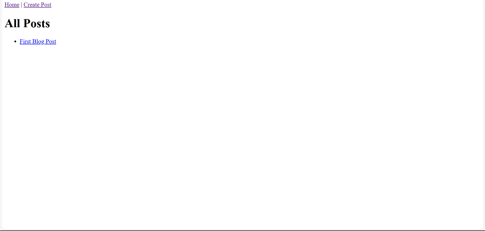

# 📝 MERN Blog Application

A full-stack blog platform built with the **MERN Stack**: MongoDB, Express.js, React.js, and Node.js. This app allows users to create, edit, and delete blog posts with image uploads, user authentication, pagination, filtering, and comments.

## 📦 Project Structure

```
mern-blog/
├── client/                 # React front-end
│   ├── public/
│   ├── src/
│   │   ├── components/
│   │   ├── pages/
│   │   ├── services/
│   │   ├── context/
│   │   ├── hooks/
│   │   └── App.jsx
│   ├── .env.example
│   └── package.json
├── server/                 # Express.js back-end
│   ├── controllers/
│   ├── models/
│   ├── routes/
│   ├── middleware/
│   ├── uploads/
│   ├── server.js
│   ├── .env.example
│   └── package.json
└── README.md
```

---

## ⚙️ Setup Instructions

### ✅ Prerequisites

- Node.js v18+
- MongoDB (local or Atlas)

### 🚀 Clone the Repository

```bash
git clone https://github.com/PLP-MERN-Stack-Development/week-4-mern-integration-assignment-Sihlesnimba.git
cd week-4-mern-integration-assignment-Sihlesnimba
```

### 🔧 Setup Server

```bash
cd server
cp .env.example .env
npm install
npm run dev
```

### 🔧 Setup Client

```bash
cd client
cp .env.example .env
npm install
npm run dev
```

---

## 🔐 .env.example Files

### 📁 server/.env.example

```
PORT=5000
MONGO_URI=mongodb://localhost:27017/mern_blog
JWT_SECRET=your_jwt_secret_key
NODE_ENV=development
```

### 📁 client/.env.example

```
VITE_API_BASE_URL=http://localhost:5000/api
```

---

## 🛠️ Features Implemented

- ✅ Create, Read, Update, Delete (CRUD) blog posts
- ✅ Image uploads using `multer`
- ✅ User authentication (JWT-based)
- ✅ Protected routes for creating/updating posts
- ✅ Pagination for post listing
- ✅ Keyword search & category filtering
- ✅ Comment system with user info
- ✅ React Router for page navigation
- ✅ Responsive UI with form validation

---

## 📸 Screenshots

### 🏠 Home Page



### ➕ Create Post


## 📚 API Endpoints

### 🔐 Auth

- `POST /api/auth/register` — Register user
- `POST /api/auth/login` — Login user

### 📝 Posts

- `GET /api/posts` — List posts (supports `page`, `limit`, `keyword`, `category`)
- `GET /api/posts/:id` — Get single post
- `POST /api/posts` — Create post _(protected)_
- `PUT /api/posts/:id` — Update post _(protected)_
- `DELETE /api/posts/:id` — Delete post _(protected)_

### 📤 Uploads

- `POST /api/upload` — Upload image _(protected)_

### 💬 Comments

- `POST /api/comments/:id` — Add comment to post _(protected)_
- `GET /api/comments/:id` — Get all comments for post

---

## 📦 Tech Stack

- MongoDB + Mongoose
- Express.js + Node.js
- React + Vite
- JWT + bcrypt
- Multer (file uploads)
- React Router + Axios + Hooks

---

## ✅ Submission

- [x] Code pushed to GitHub Classroom repo
- [x] `.env.example` included in both client and server
- [x] Functional full-stack MERN application
- [x] Complete README with setup, features, and screenshots

---

> Built by Sihle Snimba for Week 4: MERN Integration Assignment
